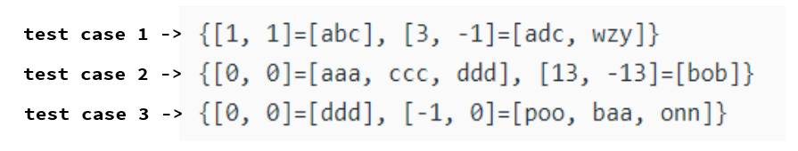

# [2451. Odd String Difference](https://leetcode.com/problems/odd-string-difference/description/)
## The aim of this approach is to get hashmaps like these for every input:


```java
class Solution {
    public String oddString(String[] words) {
        int n = words[0].length(); // diffIA length
        // storing diffIarr and corresponding string
        HashMap<String, List<String>> hm=new HashMap<>();

        for(String w: words){
            String temp="";
            for(int i = 1; i<n; i++){
                temp+= String.valueOf(('a' - w.charAt(i)) - ('a'- w.charAt(i-1)));
            }
            
            if(!hm.containsKey(temp)){
                hm.put(temp, new ArrayList<>());
                hm.get(temp).add(w);
            }else{
                hm.get(temp).add(w);
            }
        }
        for(String key : hm.keySet()){
            if(hm.get(key).size() == 1) return hm.get(key).get(0);
        }
        return "";
    }
}
```
