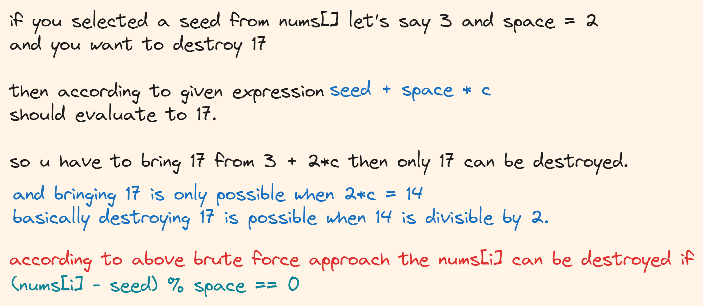
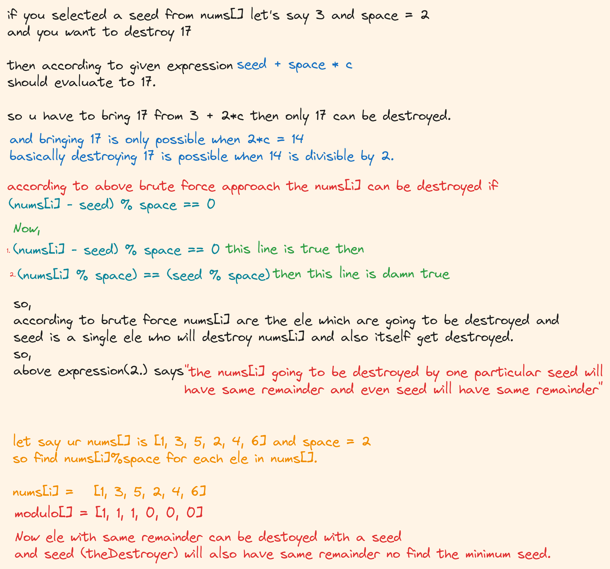

# [2453. Destroy Sequential Targets](https://leetcode.com/problems/destroy-sequential-targets/description/)

## Brute Force Approach :-
- So try to use every ele as seed and keep count of how many ele has been destroied with that seed and keep track of ur minimum seed which destroied maximum ele in nums[].

```java
class Solution {
    public int destroyTargets(int[] nums, int space) {
        int n = nums.length;
        if(n==1) return nums[0];

        int ans = Integer.MAX_VALUE;
        int td = 0;
        for(int i = 0; i<nums.length; i++){
            int seed = nums[i];
            int targetDestroyed = 0;
            for(int j = 0; j<nums.length; j++){
                if((nums[j]-seed)%space == 0) targetDestroyed++;
            }
            if(targetDestroyed == td) ans = Math.min(ans,seed);
            else if(targetDestroyed > td){
                ans = seed;
                td = targetDestroyed;
            }
        }
        return ans;
    }
}
```
## Optimised Approach

```java
class Solution {
    public int destroyTargets(int[] nums, int space) {
        HashMap<Integer, Integer> hm=new HashMap<>();
        int mf = 0;
        for(int ele : nums){ 
            hm.put(ele%space, hm.getOrDefault(ele%space,0)+1);
            mf = Math.max(mf, hm.get(ele%space));
        }
        
        int ans = (int)1e9+1;
        for(int ele :nums){
            if(hm.get(ele%space) == mf){
                ans = Math.min(ele,ans);
            }
        }
        return ans;
    }
}
```
